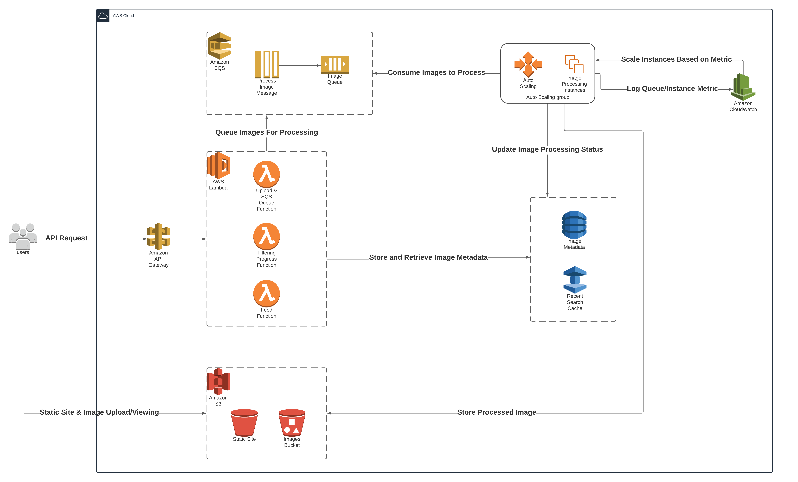

# Scalable Image Filtering Platform (powered by AWS)

## Purpose
This application serves as a platform for uploading images and applying various filters to said images, before sharing the image to the rest of the users on the platform - akin to a mashup of Instagram and DeviantArt.

The project was created as part of a university assignment for a unit in Cloud Computing. It explores the implemenation of various AWS services to create a scalable and persistent application, where it dynamically responds to changes in load, and uses both long term (S3/DynamoDB) and short term storage (ElastiCache).

## Deployment

### Prerequisites
- AWS account
- Valid AWS credentials present on your machine
- Docker
- Terraform
- ImageMagick development libraries (`sudo apt-get install libmagickwand-dev`)
- Go
- yarn

Terraform is used to deploy the various AWS services used in this application. To deploy the infrastructure:

```sh
cd deployments
terraform init
terraform apply
```
The frontend NextJS application (in `website`) is not automatically deployed (currently). To deploy the website, create a file `website/.env.local` with the contents:

```
NEXT_PUBLIC_API_URL=<api gateway url>
```
Where `<api gateway url>` is the `invoke_output` variable found after running `terraform output`.

Then,

```sh
cd wesbite
yarn build
```

And copy the entire contents of `website/out/` into the `filterit-staticsite` S3 bucket on AWS. The application should then be accessible from the S3 bucket's public URL.

## AWS Services

### Architecture Diagram



### Authors

- [Zachary Nicoll](https://github.com/zachnicoll)

- [Audi Bailey](https://github.com/audibailey)
